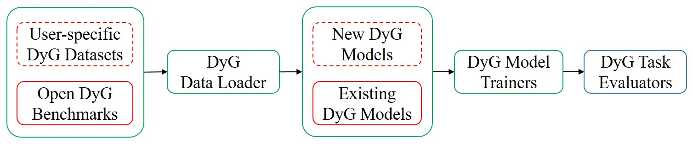

# Towards Better Dynamic Graph Learning: New Architecture and Unified Library

Dynamic Graph Library (DyGLib) is an open-source toolkit with standard training pipelines, extensible coding interfaces, and comprehensive evaluating strategies, 
which aims to promote standard, scalable, and reproducible dynamic graph learning research. Diverse benchmark datasets and thorough baselines are involved in DyGLib.



Most of the used original dynamic graph datasets come from [Towards Better Evaluation for Dynamic Link Prediction](https://openreview.net/forum?id=1GVpwr2Tfdg), 
which can be downloaded [here](https://zenodo.org/record/7213796#.Y1cO6y8r30o). 

## Environments
[PyTorch 1.8.1](https://pytorch.org/),
[numpy](https://github.com/numpy/numpy),
[pandas](https://github.com/pandas-dev/pandas),
[tqdm](https://github.com/tqdm/tqdm), and 
[tabulate](https://github.com/astanin/python-tabulate)


#### Model Training
* Example of training *Com* on *Wikipedia* dataset:
```{bash}
python train_link_prediction.py --dataset_name wikipedia --model_name DyGFormer --patch_size 2 --max_input_sequence_length 64 --num_runs 5 --gpu 0
```
* If you want to use the best model configurations to train *DyGFormer* on *Wikipedia* dataset, run
```{bash}
python train_link_prediction.py --dataset_name wikipedia --model_name DyGFormer --load_best_configs --num_runs 5 --gpu 0
```
#### Model Evaluation
Three (i.e., random, historical, and inductive) negative sampling strategies can be used for model evaluation.
* Example of evaluating *DyGFormer* with *random* negative sampling strategy on *Wikipedia* dataset:
```{bash}
python evaluate_link_prediction.py --dataset_name wikipedia --model_name DyGFormer --patch_size 2 --max_input_sequence_length 64 --negative_sample_strategy random --num_runs 5 --gpu 0
```
* If you want to use the best model configurations to evaluate *DyGFormer* with *random* negative sampling strategy on *Wikipedia* dataset, run
```{bash}
python evaluate_link_prediction.py --dataset_name wikipedia --model_name DyGFormer --negative_sample_strategy random --load_best_configs --num_runs 5 --gpu 0
```

### Scripts for Dynamic Node Classification
Dynamic node classification could be performed on Wikipedia and Reddit (the only two datasets with dynamic labels).
#### Model Training
* Example of training *DyGFormer* on *Wikipedia* dataset:
```{bash}
python train_node_classification.py --dataset_name wikipedia --model_name DyGFormer --patch_size 2 --max_input_sequence_length 64 --num_runs 5 --gpu 0
```
* If you want to use the best model configurations to train *DyGFormer* on *Wikipedia* dataset, run
```{bash}
python train_node_classification.py --dataset_name wikipedia --model_name DyGFormer --load_best_configs --num_runs 5 --gpu 0
```
#### Model Evaluation
* Example of evaluating *DyGFormer* on *Wikipedia* dataset:
```{bash}
python evaluate_node_classification.py --dataset_name wikipedia --model_name DyGFormer --patch_size 2 --max_input_sequence_length 64 --num_runs 5 --gpu 0
```
* If you want to use the best model configurations to evaluate *DyGFormer* on *Wikipedia* dataset, run
```{bash}
python evaluate_node_classification.py --dataset_name wikipedia --model_name DyGFormer --load_best_configs --num_runs 5 --gpu 0
```


## Citation

Please consider citing our paper when using this project.
```{bibtex}
@article{yu2023towards,
  title={Towards Better Dynamic Graph Learning: New Architecture and Unified Library},
  author={Yu, Le and Sun, Leilei and Du, Bowen and Lv, Weifeng},
  journal={Advances in Neural Information Processing Systems},
  year={2023}
}
```
